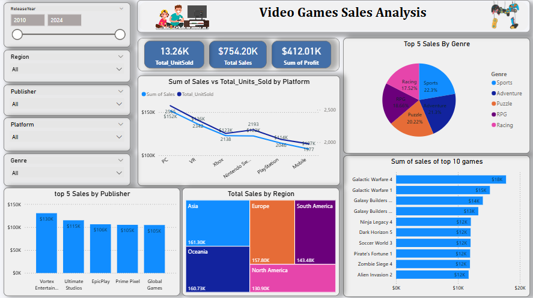

# 🎮 Video Games Sales Analysis Dashboard

This Power BI project provides a comprehensive analysis of global video game sales data between **2010 and 2024**, offering valuable insights into performance across genres, platforms, publishers, and regions.

---

## 📊 Overview

The dashboard visualizes key metrics like:

- **Total Units Sold**: 13.26K units
- **Total Sales**: $754.20K
- **Total Profit**: $412.01K

It empowers stakeholders to make data-driven decisions about genre popularity, platform performance, regional sales distribution, and publisher effectiveness.

---

## 🧩 Key Visuals & Insights

### 1. 🔢 **Total KPIs**
- **Total_UnitSold**: 13.26K
- **Total_Sales**: $754.20K
- **Sum_of_Profit**: $412.01K

### 2. 📈 **Sales vs Units Sold by Platform**
- PC and Xbox platforms lead in units sold and revenue.
- Mobile platforms show lowest performance.

### 3. 📍 **Total Sales by Region**
- **Top Regions**:
  - **Asia**: $161.30K
  - **Oceania**: $160.73K
  - **Europe**: $157.80K

### 4. 🧩 **Top 5 Sales by Genre**
- **Sports (22.3%)** and **Adventure (20.22%)** are the most successful genres.
- Others include Puzzle, RPG, and Racing.

### 5. 🏆 **Top 5 Publishers by Sales**
- Vortex Entertainment leads at ~$130K.
- Followed by Ultimate Studios, EpicPlay, Prime Pixel, and Global Games.

### 6. 🎮 **Top 10 Games by Sales**
- Highest selling title: **Galactic Warfare 4** ($18K)
- Followed by:
  - Galactic Warfare 1, Galaxy Builders, Ninja Legacy 4, and more.

---

## 🧰 Tools Used

- **Power BI Desktop**
- Slicers for dynamic filtering (Year, Region, Publisher, Platform, Genre)
- Custom visualizations:
  - **Line Charts**
  - **Treemap**
  - **Bar & Pie Charts**
  - **KPI Cards**

---

## 📁 Project Files

- `Dashboard.pbix`: Power BI file with all visuals and data model
- `Screenshot.png`: Static image preview of the dashboard

---

## 🚀 How to Use

1. Download or clone the repository.
2. Open `Dashboard.pbix` in Power BI Desktop.
3. Use slicers to filter and analyze:
   - Release Year
   - Region
   - Publisher
   - Platform
   - Genre

---

## 📌 Insights Summary

- **Sports & Adventure** genres dominate in revenue.
- **Asia** & **Oceania** show strong market potential.
- A few **publishers** dominate the top 5.
- **Mobile platforms** are underperforming in comparison.

---

## 👨‍💻 Author

**Sumit Sitaram Tikam**  
Power BI Enthusiast | Data Analytics Student

---

## 📝 License

This project is licensed for educational and analytical purposes.
